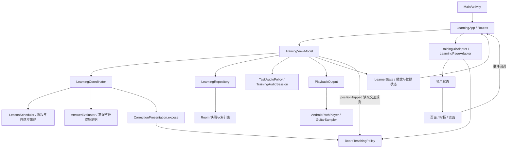

# 项目架构与修改导航

核验日期：2026-09-08；main 基线：`1c64435590fa82f8b668ea04ae043c02952adf95`（已合并 PR #61，alpha25 / 42）。本文已更新工作分支中的业务事实边界、页面框架、题型布局与谱面/和弦可访问性；对应 PR #62–#65，尚未合并。已实现、验证和保留事项见[重构计划](architecture-refactor-plan.md)。接手仍需 fetch main、核对 PR 和本地改动。

## 1. 工程与运行边界

- `settings.gradle.kts` 只包含 `:app`。以下“层”是同一 Android 模块里的逻辑职责，尚无 Gradle 模块边界强制约束。
- `app/src/main/AndroidManifest.xml` 只声明 `MainActivity`，启动 `learning/LearningApp`，由 `TrainingViewModel` 连接学习系统。
- `learning/` 是当前学习系统；旧根包页面、`training/`、`storage/` 仍参与编译和旧测试，但不在当前页面入口链上。
- `core/`、`audio/`、`ui/theme/` 是共享范围。不能以目录名称判定整目录可删除。
- `app/src/main/assets/` 是运行素材；`app/schemas/` 是 Room schema；`app/src/test/` 是 JVM/Robolectric 测试；`app/src/androidTest/` 是设备验证。
- `.github/workflows/android.yml`、`scripts/check-upgrade.sh` 管理既有构建、覆盖升级、音轨验证与可选截图。`gradle/` 和根构建文件管理工具版本。
- `docs/` 保留当前说明和有明确基线的历史交付；`.chatgpt-history/` 仅本地参考，不作为新授权或提交内容。

## 2. 实际主链

箭头表示调用或数据流，不表示独立包或模块。P1 把业务与显示共同依赖的展示/交互事实收敛到 BoardTeachingPolicy；业务不再调用显示适配器。

### 一次作答

1. 指板发 `PositionTapped(viewId, coordinate)`，选项发 `TrainingEvent.Answer`；连接层校验当前 taskId 后派发。
2. `TrainingViewModel` 校验页面可见性、任务归属、忙碌和播放状态；坐标事件调用 `BoardTeachingPolicy.input` 取得交互模式、可点击与可答范围。
3. `LearningCoordinator.answer` 调用判题，更新输入、阶段、逐成员证据、掌握状态及自适应状态，返回新的 `LearnerState`。
4. `TrainingViewModel.change` 在 IO 线程提交 repository；成功后才发布新状态、执行完成回调。失败保留旧显示状态与重试入口。
5. adapter 将新状态转换为标记、说明和按钮状态；界面不重新判题。自动下一题由 `TrainingRoute` effect 触发，最终仍经过 ViewModel 与 coordinator 校验。

### 保存与恢复

`LearningRepository.kt` 同时放置接口、Room 实体/DAO/数据库、`LearningCodec` 和实现。加载读取 JSON 快照；提交在一个事务内写快照和 attempts、skill_evidence、node_progress、learning_sessions 索引，并检查 revision。普通提交不清表；明确恢复备份时在事务中替换索引表。这里的恢复操作不是破坏性 schema 迁移。拆文件不能改变 JSON 字段、缺省值、校验规则或提交先后顺序。

### 播放与计时

`TaskAudioPolicy` 生成播放内容；`TrainingAudioSession` 管理请求归属；`PlaybackOutput` 是设备接口，`AndroidPitchPlayer` 实现实际输出，`GuitarSampler` 生成采样音频。ViewModel 协调自动首播、重听、试听、前后台、作答时钟和短谱播放。短谱另建 `pilotPlayer`，目前没有走 `suppliedOutput` 注入；它是后续可测试性改进点，不等于当前播放已出错。

## 3. 修改入口与职责

下表文件名默认位于 `app/src/main/java/com/a3322505a/guitarlearning/learning/`。

| 要改的行为 | 入口及关联文件 | 边界与最小验证 |
| --- | --- | --- |
| 启动、系统栏 | 根包 `MainActivity.kt` | 前后台、训练进出、系统栏恢复 |
| 导航、页面恢复、文件选择器 | `LearningApp.kt` | 保存完成后导航；短谱与普通训练返回语义不同 |
| 普通页面框架 | `LearningPageFrame.kt` 的顶栏、标题、滚动容器、加载和通用对话框 | 只接显示值与回调；页面内容最大 960dp |
| 普通页面视觉样式 | `LearningPageStyle.kt`，由 `LearningPageFrame` 顶栏和 `LearningPageBody` 局部应用 | 字体、圆角不修改全局训练/图形主题；颜色沿用四套 `LocalGuitarColors` |
| 首页、目录、知识树、详情、历史、设置 | `LearningPages.kt` | `LearningPageUiState.kt` 接数据，`LearningPageAdapter.kt` 投影业务事实 |
| 普通训练排版 | `TrainingScreen.kt` 分派与共享控件；`TrainingLayouts.kt` 文字、指板（含谱面）、和弦模板；`RelationContent.kt` | 仅消费显示契约；短窗口和大字号滚动回退 |
| 短谱入口与训练排版 | `PilotContent.kt` | `PilotMenu`、`PilotTrainingScreen`；检查对照谱、完成、自评及键盘 |
| 和弦示例/逐弦控件/图例 | `ChordContent.kt` | 与图形绘制区分；设置事件回传，不直接保存 |
| 普通指板绘制与触点 | `TeachingFretboard.kt`、`TeachingGeometry.kt` | 绘制/命中统一几何；只接 `FretboardUiState` 与坐标事件 |
| **当前和弦图** | `ChordDiagram.kt` 的 `ChordDiagram` / `ChordDiagramGeometry` | `TeachingFretboard` 在 chord 非空时直接转入；横竖同一弦品事实 |
| 谱面 | `NotationView.kt`；数据为 `ReadingLessons.kt` 中 `NotationPrompt`、`ShortScores.kt` 中 `ShortScore` | 吉他谱面高于发声八度；音高题与 TAB 指定位置判题不同 |
| 主题 | `ui/theme/GuitarColors.kt`、`Theme.kt`、`PixelTypography.kt`、`PixelShapes.kt` | 四主题、字体；和弦背景/文字取主题，手指固定颜色保持识别 |
| 训练显示契约和投影 | `TrainingUiState.kt`、`TrainingUiAdapter.kt` | 独立题不得通过标记、范围或新字段泄露答案 |
| 共享展示/暴露/点击事实 | `BoardTeachingPolicy.kt` | 无 UI 标记和文案依赖；供 adapter、纠错暴露、ViewModel 共用 |
| 页面分组与进度投影 | `LearningPageAdapter.kt`、`LearningPresentation.kt`、`CapabilityGroups.kt` | 分类顺序不是先修；历史通过不是近期双向熟练 |
| 课程、排课 | `Curriculum.kt`、`LessonScheduler.kt` | 课程图和出题入口均需接入；保留现有任务快照 |
| 音名/唱名/级数 | `MappingLessons.kt`、`core/MusicFacts.kt` | 各方向分别留证据；级数必须带调性 |
| 读谱课程 | `ReadingLessons.kt` | TAB 坐标、五线谱音高、序列逐项目标 |
| 和弦课程与素材 | `ChordShapes.kt`、`ChordLessons.kt` | 形态数据统一驱动显示/发音/判题 |
| 关系、音程、音阶、听辨 | `StructureLessons.kt`、`MusicRelations.kt`、`MusicSpelling.kt` | 先修、实际音高与拼写；听辨播放完成门槛 |
| 增量课程/创作 | `FurtherLessons.kt`、`FurtherHarmony.kt` | 由既有课程/调度接入；创作保留回听和手动推进 |
| 专项 | `PracticeLessons.kt`、`PracticeContent.kt` | 后端能力与实际导航可达性分别核验 |
| 短谱试用业务 | `ShortScores.kt`、ViewModel 短谱方法 | 8 段角色/素材曝光、暂停位置、计时、自评分开记录 |
| 实琴自评 | `PhysicalPractice.kt`、`LearningPageAdapter.node`、ViewModel `physical` | 自评不能替代手机独立判题证据 |
| 状态迁移/返回/区域切换 | `LearningCoordinator.kt`，同文件 `RegionSessions` | 跨区域暂停、返回结束、跨轮保护保留 |
| 判题与证据 | `AnswerEvaluator.kt`、`MemberEvidencePolicy.kt`、`MasteryPolicy.kt` | 首答/纠正/辅助分开；未答成员不得复制整体结论 |
| 区域调度 | `RegionTraining.kt`、`RegionRounds.kt`、`AdaptiveTraining.kt` | 轮次、热身/主练/收尾与恢复优先级 |
| 混合方向/局部恢复/上探 | `AdaptiveMix.kt`、`RegionProtection.kt`、`RegionProgression.kt` | 七音选项、逐点恢复、上探先修；不要另写一套门槛 |
| 题型内恢复与近期证据 | `FamilyAdaptation.kt`、`AdaptiveEvidence.kt` | 范围、方向、辅助暴露与独立样本条件 |
| 长考/流利/轮次负荷 | `ResponseTiming.kt`、`RoundExperience.kt` | 前后台排除、有效计时、跨轮保存；`Fluency`/`MiddleReadiness` 在后者 |
| 释义/纠错/知识暴露 | `LessonExplanations.kt`、`CorrectionPresentation.kt` | P1 起从 BoardTeachingPolicy 读取暴露坐标，见下一节 |
| 状态、任务与备份模型 | `LearningModels.kt` 及各业务文件内的 Serializable 类型 | 新字段兼容旧快照；不随意改序列化类型/ID |
| 存储/备份 | `LearningRepository.kt`、ViewModel `export` / `restore` | Room、JSON、revision、事务回滚、恢复前副本 |
| 音频策略/设备 | `TaskAudioPolicy.kt`、`TrainingViewModel.kt`、`audio/` | 首播去重、陈旧回调隔离、取消单次释放 |

## 4. 当前页面与可达性

| 页面 | 来源与显示 | 核验备注 |
| --- | --- | --- |
| 首页 | `home` → `HomeContent` | 四入口，设置在顶栏 |
| 吉他入门/指板训练/进阶应用 | `group:*` → `CatalogContent` | 入门内有短谱；进阶内有和弦示例 |
| 知识树 | `tree` → `TreeContent` | 能力聚合行；可进入历史或节点详情 |
| 节点详情 | `node:*` → `NodeContent` | 展示能力组描述，开始目标可能是组内下一节点 |
| 历史 | `history` → `HistoryContent` | 会话卡片可打开节点详情 |
| 设置 | `settings` → `SettingsContent` | 外观、指法、声音、备份和版本 |
| 和弦示例 | `chord-examples` → `ChordExamples` | 强制横屏，仍用普通页面纵向框架 |
| 短谱 | `score-pilot` → `PilotMenu` → training | 训练时转入 `PilotTrainingScreen` |
| 普通训练 | `training` → `TrainingScreen` | 按显示状态分派 SymbolTaskLayout / BoardTaskLayout / ChordTaskLayout；短谱单独分派 |
| 专项设置 | `practice:*` → `PracticeContent` | 路由/业务存在，但 `LearningPageAdapter.node` 固定 canPractice=false，CatalogContent 的 practice 回调未使用；不能称正常首页流程已开放入口 |
| 分类页 | `category:*` → `CatalogContent` | 分支存在；现有首页使用 group 路由，不据此新增用户入口 |

## 5. 真正需要厘清的边界

1. **P1 已移除业务反向依赖显示适配器。** 原来 `CorrectionPresentation.expose` 通过 UI 的 MarkRole 和标签筛选知识暴露；现在 BoardTeachingPolicy 返回语义明确的位置知识事实，adapter 转换为文案/标记，expose 读取暴露坐标。改标签不再决定知识暴露；共同规则仍需相应证据回归。
2. **P1 已隔离输入资格与 UI 投影。** ViewModel 和 adapter 共同使用 BoardTeachingPolicy 的输入模式及范围。原有忙碌时只试听、听辨禁用、已完成短谱禁用等规则保留；页面/陈旧任务/播放状态校验仍在 ViewModel，不靠 UI 禁用替代。
3. **页面框架已提取（P2 工作分支）。** `LearningApp` 的顶栏、滚动容器、标题、加载与通用对话框移入 `LearningPageFrame`；连接层保留路由及备份文件选择状态。
4. **契约并非彻底独立的数据层。** `TrainingUiState` 引用 `NotationPrompt` 和 `PilotControlsUi`；后者定义在页面文件；`LearningPageUiState` 引用 `PhysicalExercise`；显示组件直接枚举 `FingeringMode`/`AppTheme`。这些纯值共享不等于访问 ViewModel，但以后搬包必须考虑它们及序列化兼容。
5. **ViewModel 聚合多种副作用。** 普通训练、短谱播放器、计时、备份均在同文件。可以按独立生命周期和测试需求提取协作者，先保持一个提交协调入口；仅按行数拆分没有收益保证。
6. **Repository 文件混合存储与档案校验。** 有分离接口/Room/codec 的维护价值，但文档梳理不需要更换数据库架构；业务引用用于备份有效性验证，不应直接删除。
7. **不可达绘制分支已清理。** `TeachingFretboard` 对 chord 非空立即转入 `ChordDiagram`；P3 删除了后续重复和弦分支。`ChordContent.ChordOverlay` 函数尚保留但当前无调用，不能作为当前和弦修改入口。它与旧 v1 指板不是同一个概念。
8. **契约字段已补接。** P2 将普通题 `state.audio.message/failed` 接入显示与重试；P3 将 `ChordToneUi.rootRing/dot` 接入和弦绘制。读屏位置动作仍只从允许交互集合生成，不带隐藏答案。

## 6. legacy 与共享依赖

详见 [legacy-v1.md](legacy-v1.md)。本次复核当前 learning 源码未引入旧 training/storage/根包 Screen；但它们仍在 main source set，删除可能破坏编译与旧测试。

| 范围 | 当前判断 | 处理原则 |
| --- | --- | --- |
| 根包 `GuitarLearningApp.kt` 与五个旧训练 Screen | legacy 页面 | 新导航不接入，修改它们不会修复当前训练页 |
| `training/`、`storage/` | legacy 业务/SharedPreferences 档案 | 不双写、不恢复旧会话 |
| `ui/components/`、`ui/choices/`、`ui/feedback/`、`ui/fretboard/` | 旧显示组件 | 复用素材先审依赖，不能整目录认定共享 |
| `core/MusicFacts.kt` | 当前与旧代码共享音乐事实 | 保留 |
| `core/GuitarCore.kt` | 旧规则及 `FretPosition` 类型 | `audio/PitchModels.kt` 和 `FretboardAudio.kt` 仍引用 FretPosition；不能直接删 |
| `audio/` | 设备实现、请求/音高模型及旧兼容接口混合 | 当前 PlaybackOutput 与旧 PitchPlayer 不同；逐符号判定 |
| `ui/theme/` | 新旧主题资源混合 | 当前 Theme 使用 GuitarColors、PixelTypography、PixelShapes；逐文件核验 |
| 旧测试 | 编译/回归参考 | 不证明功能从新版导航可达 |

## 7. 验证与维护方式

| 改动 | 优先沿用的验证 |
| --- | --- |
| 文档/入口说明 | 本地链接、源码符号、git diff --check；不增版本/APK |
| 显示适配/暴露/交互策略 | TrainingContractsTest、ProgressionVisualsTest、ExperiencePolicyTest、TrainingAudioIntegrationTest，以及对应逐成员/恢复反例 |
| 布局/绘制 | ContractPreviews、现有 UiPreviewTest 扩充受影响状态；检查内容可见、操作可达和实际触点，不以截图生成成功替代审图 |
| 课程/调度/判题 | LearningLoopTest 与对应 Lessons、Region、Adaptive、Mapping 等现有测试 |
| 存储/模型 | LearningRepositoryTest、UpgradeSmokeTest；旧快照、暂停恢复、事务失败、覆盖安装 |
| 音频/计时 | TrainingAudioIntegrationTest、PlaybackProgressTest、AudioOutputSmokeTest；设备听感另验 |

现有 CI 用 JDK 17 执行单测、Debug/Release 构建、API 35 覆盖升级和音轨检查。截图是可选人工审阅产物，不是覆盖率门槛。本机前轮 lint 被 Java 9 阻断，不能宣称 lint 或模拟器验证通过。

每次变更在 PR 写明：改哪条职责、受影响入口、保留的数据/音频约束、已执行验证及限制。变更职责或导航时同步本文与 README，变更操作边界时同步 AGENTS；历史 alpha 记录保留原交付事实。

## alpha29 增量入口

- `LessonRounds` 从当前会话任务 ID 推导普通轮次边界，`LearningCoordinator.next` 在原提交链内结算；`TrainingRoute` 保持结果页，`TrainingViewModel` 处理继续/低把位事件。不新增数据字段或服务器。
- `TabMaterial` 共用已教低把位和12条短句事实，`ReadingLessons`、`FamilyAdaptation`、`PracticeLessons` 接入同一内容池。原 `ShortScorePilot` 与独立基线/复测范围不变。
- `MappingLessons` 以示范开放表示，`FamilyAdaptation` 以诊断起点后的任务推进补练与原条件复测。证据和课程达标仍由原策略计算。
